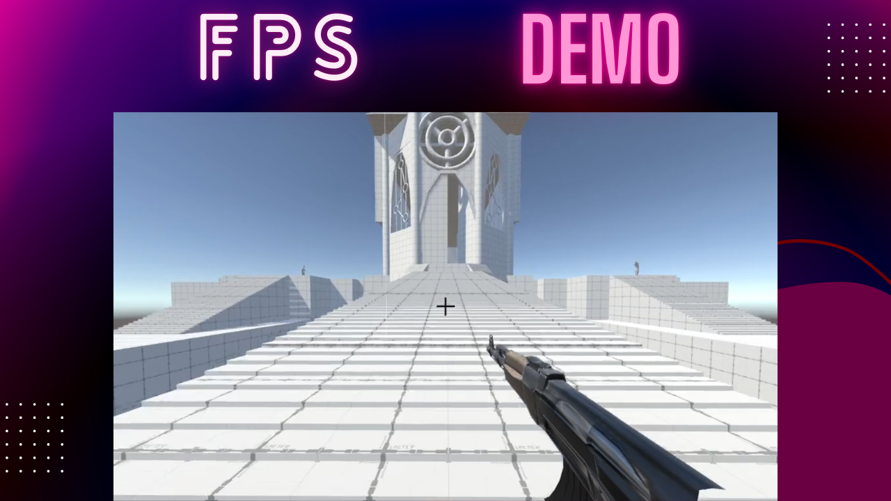

# unity-fps-demo

A first-person shooter demo adapted from games like Doom made in Unity.

## Features

### Gameplay Mechanics:
- Double Jump
- Dash
- Grappling Hook
- Trampoline 
- Grabbing onto certain walls
- Jumping and Climbing

### Levels with Probuilder:
- Map with different elements

### Animation:
- Idle
- Walking
- Attack
- Hit
- Dying
- Running

### Artificial Intelligence:
- Search Range
- Firing Range
- Random Movement
- Waiting 

### Settings:
- AI Life
- AI Destruction
- AI Shooting
- Player Life
- Player Destruction
- Player Shooting

## Demo

## Gameplay Demo

## Tech

- Unity
- C#